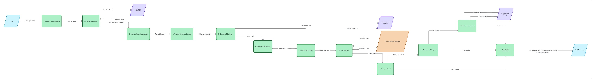

# Диаграмма 3. Data Flow Diagram (DFD)

**Рисунок 4.3 – Диаграмма потоков данных AI-ассистента.**

DFD-диаграмма демонстрирует последовательность обработки пользовательского запроса внутри системы.

Основные этапы обработки включают:

1. получение пользовательского запроса;
2. аутентификацию пользователя;
3. обработку естественного языка;
4. анализ структуры базы данных;
5. генерацию SQL-запроса;
6. проверку прав доступа;
7. валидацию SQL;
8. выполнение запроса;
9. анализ полученных результатов;
10. генерацию аналитических выводов;
11. создание интеллектуальных уведомлений;
12. подготовку итогового ответа пользователю.

Для хранения информации используются специальные хранилища:

* User Sessions;
* AI Query History;
* Corporate Database;
* AI Alerts Storage.

На выходе пользователь получает результаты в виде таблиц, текстовых пояснений, графиков, KPI-показателей и интеллектуальных рекомендаций.
