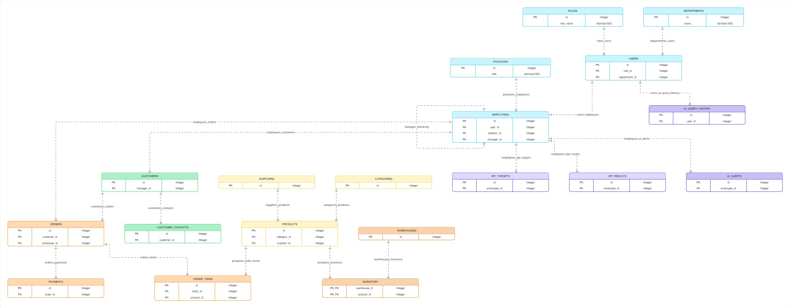

# Диаграмма 4. ER-диаграмма базы данных

**Рисунок 4.4 – ER-диаграмма корпоративной базы данных AI-ассистента.**

| Таблица           | Назначение                             |
| ----------------- | -------------------------------------- |
| roles             | Хранение ролей пользователей           |
| departments       | Хранение подразделений компании        |
| positions         | Хранение должностей сотрудников        |
| users             | Хранение учётных записей пользователей |
| employees         | Хранение информации о сотрудниках      |
| customers         | Хранение информации о клиентах         |
| customer_contacts | Контактные лица клиентов               |
| categories        | Категории товаров                      |
| suppliers         | Поставщики товаров                     |
| products          | Каталог товаров                        |
| warehouses        | Склады компании                        |
| inventory         | Остатки товаров на складах             |
| orders            | Заказы клиентов                        |
| order_items       | Состав заказов                         |
| payments          | Платежи по заказам                     |
| kpi_targets       | Плановые KPI сотрудников               |
| kpi_results       | Фактические KPI сотрудников            |
| ai_query_history  | История запросов к AI-ассистенту       |
| ai_alerts         | Интеллектуальные уведомления системы   |

**Таблица 4.1 - Описание сущностей базы данных.**

ER-диаграмма отражает логическую структуру корпоративной базы данных, разработанной для функционирования AI-ассистента. База данных предназначена для хранения информации о пользователях системы, сотрудниках организации, клиентах, товарах, поставщиках, заказах, складских запасах, ключевых показателях эффективности сотрудников, а также специализированных сущностях, обеспечивающих работу интеллектуальных функций системы.

Структура базы данных построена по принципам нормализации данных и включает взаимосвязанные сущности, объединённые отношениями типа «один ко многим» и «многие ко многим». Это позволяет минимизировать избыточность информации и обеспечить целостность данных при выполнении аналитических запросов.

Для упрощения восприятия сущности базы данных можно разделить на несколько функциональных групп.

## Управление пользователями

Блок включает таблицы:
- Roles;
- Departments;
- Positions;
- Users;
- Employees.

Данные сущности обеспечивают хранение информации о пользователях системы, их должностях, подразделениях, ролях доступа и организационной структуре компании.

## Управление клиентами

Блок состоит из таблиц:
- Customers;
- Customer_Contacts.

Он предназначен для хранения информации о клиентах компании и контактных лицах.

## Управление товарами и складом

В состав блока входят:
- Categories;
- Suppliers;
- Products;
- Warehouses;
- Inventory.

Данные таблицы обеспечивают ведение каталога товаров, поставщиков и складского учёта продукции.

## Управление заказами

Блок включает:
- Orders;
- Order_Items;
- Payments.

Он реализует хранение информации о заказах клиентов, составе заказов и произведённых платежах.

## Аналитический блок

В состав входят:
- KPI_Targets;
- KPI_Results.

Данные сущности предназначены для хранения плановых и фактических показателей эффективности сотрудников.

## Блок искусственного интеллекта

Содержит таблицы:
- AI_Query_History;
- AI_Alerts.

Первая таблица хранит историю взаимодействия пользователей с AI-ассистентом и информацию о сформированных SQL-запросах. Вторая предназначена для хранения автоматически сформированных системой интеллектуальных уведомлений.

Разработанная структура базы данных обеспечивает поддержку основных бизнес-процессов организации и позволяет реализовать функциональность AI-ассистента для работы с корпоративными данными. Логическая модель охватывает процессы управления пользователями, клиентами, товарами, заказами, складскими запасами и аналитическими показателями, а также включает специализированные сущности для реализации интеллектуальных функций системы.
