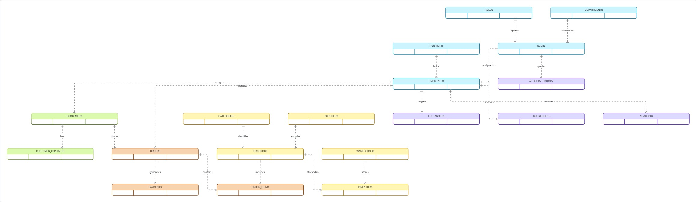

# Диаграмма 1. High-Level Architecture

**Рисунок 4.1 – Высокоуровневая архитектура AI-ассистента для работы с корпоративной базой данных.**

Данная диаграмма отражает основные сущности корпоративной информационной системы и взаимосвязи между ними. Архитектура разделена на несколько логических доменов:

* управление пользователями и сотрудниками;
* работа с клиентами;
* управление товарами, поставщиками и складскими запасами;
* обработка заказов и платежей;
* контроль KPI сотрудников;
* интеллектуальные функции AI-ассистента.

Пользователи системы принадлежат определённым ролям и подразделениям, сотрудники взаимодействуют с клиентами и оформляют заказы. Заказы содержат товары, для которых ведётся складской учёт. Отдельный блок отвечает за анализ эффективности сотрудников посредством KPI.

Для реализации интеллектуальных функций предусмотрены специальные сущности:

* AI Query History — журнал запросов пользователей;
* AI Alerts — система интеллектуальных уведомлений.

Данная архитектура обеспечивает модульность системы и позволяет интегрировать AI-ассистента в существующие бизнес-процессы компании.
