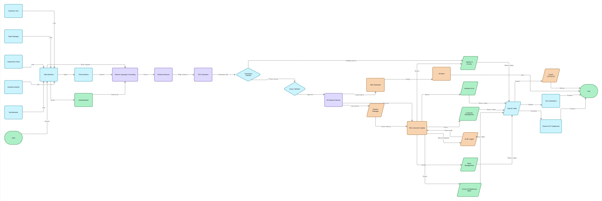

# Диаграмма 2. System Architecture

**Рисунок 4.2 – Архитектура функционирования AI-ассистента.**

Диаграмма описывает общий процесс взаимодействия пользователей с системой. Работа начинается с обращения одного из пользователей: менеджера по продажам, руководителя отдела, бизнес-аналитика или администратора.

После аутентификации пользователь отправляет запрос через веб-интерфейс. Система выполняет обработку естественного языка, анализирует структуру базы данных и формирует SQL-запрос.

Перед выполнением производится проверка прав доступа и валидация сформированного SQL-кода. После успешной проверки запрос передаётся механизму выполнения SQL.

Полученные данные анализируются AI-модулем, который может:

* сформировать аналитические выводы;
* создать интеллектуальные уведомления;
* подготовить графики и KPI-панели;
* предоставить текстовое объяснение результатов;
* экспортировать данные в CSV или XLSX.

Архитектура обеспечивает безопасное выполнение запросов и автоматическую генерацию аналитической информации.
